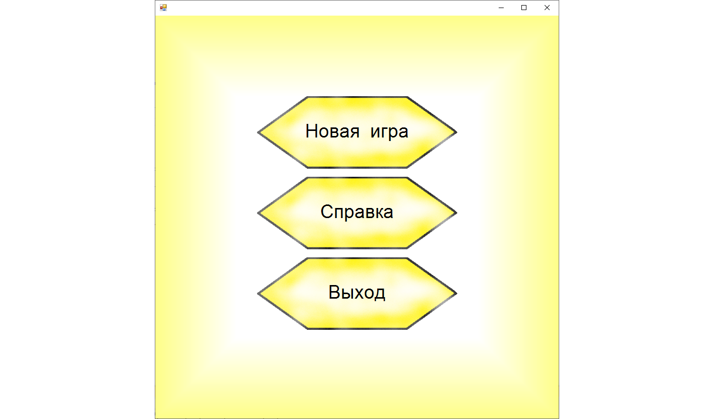
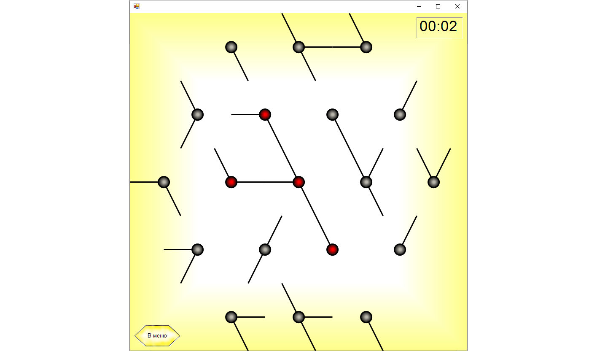
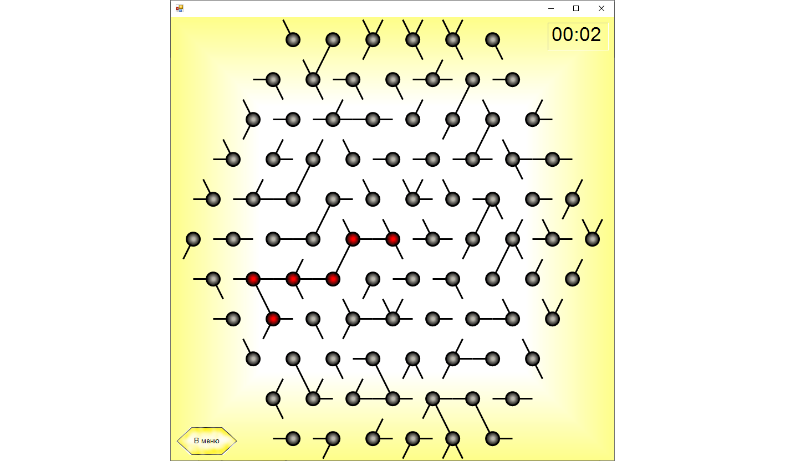

# FairyLights
Игровое приложение, выполненное на WinForms

Игра представляет собой головоломку, цель игры подсоединить все лампочки к источнику.

Основное меню игры:

Игра имеет несколько уровней сложности, самый простой представлен ниже:

Управление осуществляется кликами мышкой по лампочкам. Самый сложный уровень представлен ниже:

Уровни генерируются автоматически.
